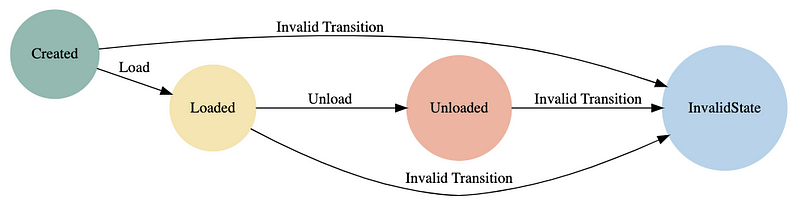

State design pattern, bir nesnenin iç durumuna bağlı olarak davranışının değişmesini sağlar. Karmaşık durum ve davranışların yönetiminde kullanılır. Bu pattern, bir nesnenin durumuna bağlı olarak davranışlarının değişmesini sağlayarak kodun daha modüler, okunabilir ve genişletilebilir olmasını sağlar. 

State design pattern'in en büyük avantajı, yeni durumlar eklemek veya mevcut durumları değiştirmek istediğimizde kodun değişmeden kalmasıdır. Bu, yazılımın sürdürülebilirliğini artırır ve kod tabanındaki karmaşıklığı azaltır. State Design Pattern, sonlu durum makineleriyle oldukça benzerdir.

Örneğin, kargoların gönderi durumunu yöneten bir sistem düşünelim. Bu sistemde bir gönderi oluşturulduğunda "Created" durumuna geçer, arabaya yüklendiğinde "Loaded" durumuna geçer, teslimat noktasına ulaştığında ise "Unloaded" durumuna geçer. "Created", "Loaded" ve "Unloaded" durumlarından geçersiz bir geçiş yapılmaya çalışıldığında "InvalidState" durumu ortaya çıkar. Örneğin, "Created" durumundan direkt "Unloaded" durumuna geçemeyiz. 



```java
    public class ShipmentState {
        private static final int CREATED = 1;
        private static final int LOADED = 2;
        private static final int UNLOADED = 3;
        private static final int INVALID_STATE = 4;

        private int currentState;

        public ShipmentState() {
            this.currentState = CREATED;
        }

        public void updateState(int value) {
            if (currentState == CREATED && value == LOADED) {
                currentState = LOADED;
                System.out.println("Shipment Created. Current state: LOADED");
            } else if (currentState == LOADED && value == UNLOADED) {
                currentState = UNLOADED;
                System.out.println("Unload operation performed. Current state: UNLOADED");
            } else {
                currentState = INVALID_STATE;
                System.out.println("Invalid transition: Current state: INVALID_STATE");
            }
        }
    }

    public class Main {
        public static void main(String[] args) {
            ShipmentState shipmentState = new ShipmentState();

            //Created -> Loaded
            System.out.println("Enter state transition value (1 for CREATED, 2 for LOADED, 3 for UNLOADED):");
            String value1 = getState();
            shipmentState.updateState(Integer.parseInt(value1));

            // Loaded -> Unloaded
            System.out.println("Enter next state transition value (1 for CREATED, 2 for LOADED, 3 for UNLOADED):");
            String value2 = getState();
            shipmentState.updateState(Integer.parseInt(value2));
        }

        static String getState() {
            BufferedReader in = new BufferedReader(new InputStreamReader(System.in));
            String line = null;
            try {
                line = in.readLine();
            } catch (IOException ex) {
                ex.printStackTrace();
            }
            return line;
        }
    }
```

Pattern kullanmadan kodu yazdığımızda if-switch yapılarından yardım alıyoruz. Yukarıdaki kod ilk bakıldığında küçük ve anlaşılır gözükebilir ancak araya yeni bir durum eklediğimizi düşünelim. Bu durumun adı “Delivered” olsun. Bu durumu eklerken tekrar bir if-else eklememiz gerekecek. İlerleyen günlerde, kullanıcı tarafından teslim alınmış ancak beğenilmemiş kargoları geri iade etme işlemi için bir durum eklenmek istendiğini düşünelim. Bu durumu eklerken tekrar if-else blokları eklemem gerekecek. Bu şekilde ilerlerken kodlar bir süre sonra karmaşık ve okunamaz hale gelir. Geliştirme yaparken bu istenilen bir durum değildir.

Bu kodu bir de state pattern kullanarak yazmaya çalışalım.


### 1. Context (ShipmentContext)

Kargoların gönderi durumunu takip eden ve durumlar arası geçişi sağlayan sınıftır.

```java 
public class ShipmentContext {
    private ShipmentState shipmentState;

    public ShipmentContext(ShipmentState shipmentState) {
        this.shipmentState = shipmentState;
    }

    public ShipmentContext() {

    }

    public ShipmentState getShipmentState() {
        return shipmentState;
    }

    public void setShipmentState(ShipmentState shipmentState) {
        this.shipmentState = shipmentState;
    }

    public void load() {
        shipmentState.load(this);
    }

    public void unload() {
        shipmentState.unload(this);
    }
}
```

### 2. Interface (ShipmentState)

Kargo gönderileri durumları için bir interface oluşturdum. Statelerin gerçekleştirmesi gereken ortak metotları içerir. Böylece implement eden sınıflar bu metotları kendi durumlarına göre kullanabilecekler.

```java
    public interface ShipmentState {
        void load(ShipmentContext shipmentContext);

        void unload(ShipmentContext shipmentContext);
    }
```

### 3. Concrete States (CreatedState, LoadedState, UnloadedState ve InvalidState)

Concrete state’ler, CreatedState, LoadedState, UnloadedState ve InvalidState gibi kargo gönderi takip sisteminde gönderilerin belirli durumlarını temsil eder. CreatedState, LoadedState, UnloadedState ve InvalidState sınıflarını ShipmentState sınıfından implement ettim. Böylece her durum kendi metottunu kendine göre tanımlar.

```java
    public class CreatedState implements ShipmentState {
        @Override
        public void load(ShipmentContext shipmentContext) {
            shipmentContext.setShipmentState(new LoadedState());
            System.out.println("Shipment Created. Current state: Loaded");
        }

        @Override
        public void unload(ShipmentContext shipmentContext) {
            shipmentContext.setShipmentState(new InvalidState());
            System.out.println("Invalid transition. Current state: InvalidState");
        }
    }
```


```java
    public class LoadedState implements ShipmentState {
    @Override
    public void load(ShipmentContext shipmentContext) {
        shipmentContext.setShipmentState(new InvalidState());
        System.out.println("Invalid transition. Current state: InvalidState");
    }

    @Override
    public void unload(ShipmentContext shipmentContext) {
        shipmentContext.setShipmentState(new UnloadedState());
        System.out.println("Unload operation performed. Current state: Unloaded");
    }
}
```


```java
    public class UnloadedState implements ShipmentState {
    @Override
    public void load(ShipmentContext shipmentContext) {
        shipmentContext.setShipmentState(new InvalidState());
        System.out.println("Invalid transition. Current state: InvalidState");
    }

    @Override
    public void unload(ShipmentContext shipmentContext) {
        shipmentContext.setShipmentState(new InvalidState());
        System.out.println("Invalid transition. Current state: InvalidState");
    }
}
```


```java
    public class InvalidState implements ShipmentState {
    @Override
    public void load(ShipmentContext shipmentContext) {
        System.out.println("Invalid transition: Load operation is not allowed in the current state");
    }

    @Override
    public void unload(ShipmentContext shipmentContext) {
        System.out.println("Invalid transition: Unload operation is not allowed in the current state");
    }
}
```


```java
    public class Main {
        public static void main(String[] args) {
            ShipmentContext shipmentContext = new ShipmentContext();

            shipmentContext.setShipmentState(new CreatedState());
            shipmentContext.load();

            shipmentContext.setShipmentState(new LoadedState());
            shipmentContext.unload();

            shipmentContext.setShipmentState(new UnloadedState());
            shipmentContext.unload();
        }
    }
```

Kısacası state design pattern, yazılım geliştirme sürecinde durum yönetimi gerektiren herhangi bir senaryoda kullanılabilir. Kodunuzu daha temiz, esnek ve bakımı kolay hale getirir.

Bu yazıda basit bir kargo takip sistemi örneği üzerinden state design pattern’ini anlattım. Umarım yararlı olmuştur. Projenin tamamına [github](https://github.com/halimeozturk/state-design-pattern) hesabımdan ulaşabilirsiniz.

# Kaynaklar

- [Refactoring Guru - State Design Pattern](https://refactoring.guru/design-patterns/state)
- [SourceMaking - State Pattern](https://sourcemaking.com/design_patterns/state)
- [GeeksforGeeks - State Design Pattern](https://www.geeksforgeeks.org/state-design-pattern)
- [Baeldung - Java State Design Pattern](https://www.baeldung.com/java-state-design-pattern)